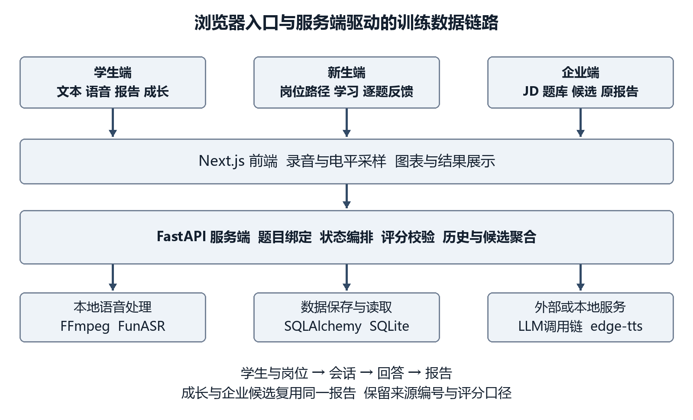
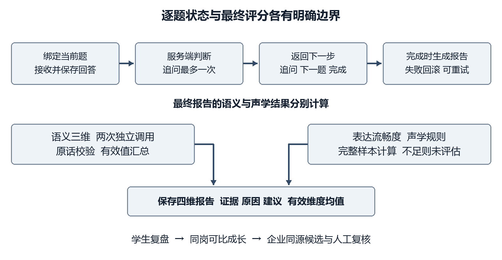
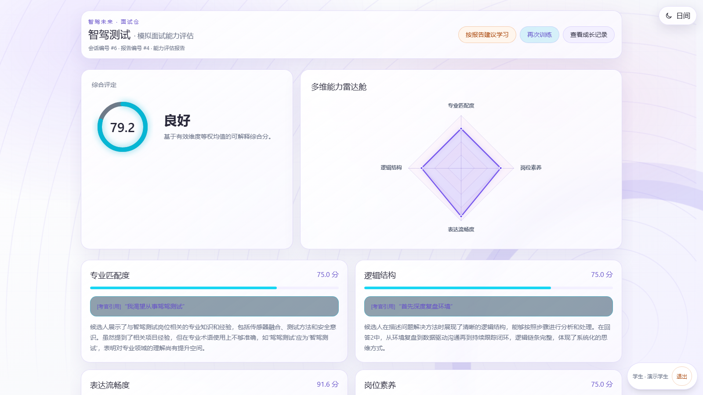
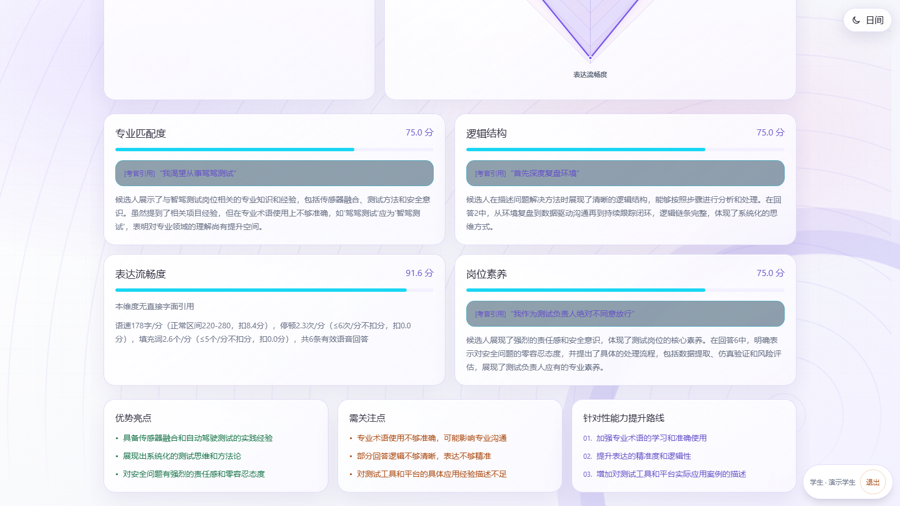
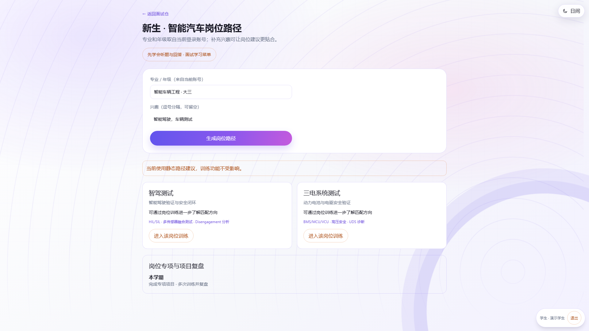
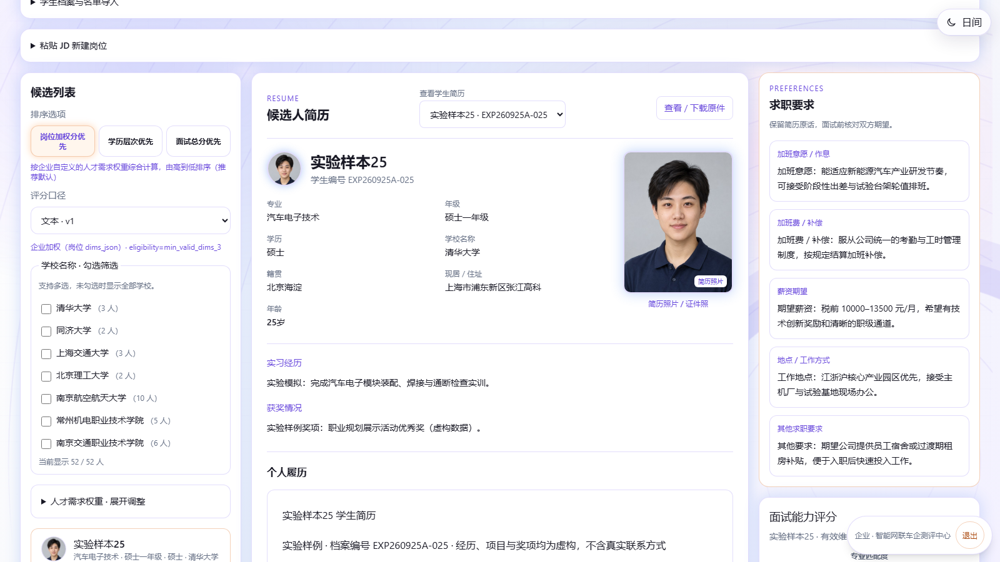

# 智能面试仓的开发与应用

智驾未来 AI面试仓

中国·上海第九届青少年人工智能创新大赛

AI+匠心智造职教赛道 企业命题05

参赛组别：本科组（应用型本科）

参赛编号：JX80045

团队名称：芝麻队

团队规模：指导教师1名；成员4人，分工详见第九章

编制日期：2026年10月1日

<!-- PAGEBREAK -->

## 项目摘要

本项目围绕企业命题05“智能面试仓的开发与应用”，开发面向智能汽车产业岗位的AI面试训练平台，连接新生岗位认知、学生模拟面试、训练复盘与企业候选人初筛。项目以智驾测试和三电系统测试两个种子岗位为核心，将岗位要求、专业术语和真实工作情境纳入提问与评分，帮助学生把所学知识转化为可清楚说明、可追问核验的面试回答。

平台提供文本与语音两种训练方式，由服务端决定当前问题和下一步状态。每场面试包含两道通用题、三道专业题和一道情景题，每道主问题最多追加一次追问。语音回答经浏览器录音、FFmpeg转码和本地FunASR识别形成文本，同时采集回答时长、语速、停顿和填充词。正式报告固定采用专业匹配度、逻辑结构、表达流畅度和岗位素养四维结构：语义维度通过两次独立模型调用汇总，并校验原话证据；表达流畅度由声学统计规则计算。文本训练或声学数据不足时，该维度显示“未评估”，不以零分代替。

同一学生同一岗位的会话与报告可用于历史回看和可比趋势分析。企业候选列表直接聚合学生端已完成的会话与报告，按照输入类型和评分版本分组，每名学生选取最近一次符合完整性要求的报告，并保留原报告入口。新生端将专业、年级和兴趣转化为岗位地图及学习路径，连接现有训练入口；面试学习菜单和逐题练习反馈帮助学生理解题意、组织真实经历和按建议再次训练。

截至本报告编制日，平台已全面打通“新生岗位认知—学生定向模拟面试—多维可解释评分报告—历次训练成长追踪—企业同源初筛”的全流程业务闭环。系统在自动化测试套件中实现后端118项单元测试与42项业务闭环测试全量通过，前端构建与类型校验零错误。平台凭借垂直岗位题库、声学与语义双模可解释评分、原话证据防幻觉校验以及端到端数据可追溯性，具备显著的技术可行性与落地应用价值，为高校汽车专业实训教学与车企高效初筛提供了高可靠的数智化工具。

关键词：智能面试仓；智能汽车；岗位定向；可解释评分；声学特征；成长追踪

## 阅读说明

正文按命题文件要求组织为十章，另附附录A（AI工具清单）和附录B（关键Prompt原文）。第一章阐述产业背景与需求分析；第二、三章说明系统架构与技术创新；第四、五章介绍核心功能与测试验证；第六至八章讨论实际应用场景、高可用部署与商业化推广；第九章列明团队分工；第十章给出参考文献与支撑证据。页面截图展示当前平台实际运行交互界面（日间模式）。按盲评规定，学校信息、团队成员真实姓名及指导教师信息仅见《项目概况表》，报告正文一律使用代号制。

<!-- TOC -->

# 第一章 项目背景与需求分析

## 1.1 命题背景与项目切入点

企业命题05提出三个相互关联的问题：新生不清楚企业需求和职业发展路径，毕业生缺少接近真实场景的面试训练，企业初筛耗费较多时间且难以快速判断岗位适配程度。命题预期形成学生训练与企业筛选的双向闭环，并让学生能够持续追踪成长。项目因此不能只完成问答机器人或单张评分报告，而应把岗位认知、训练、证据、复盘和候选信息连接起来。［1］

我们选择智能汽车产业作为落点。智驾测试与三电系统测试都要求学生同时具备专业知识、验证思路、跨角色沟通和安全责任意识。学生即使掌握若干术语，也可能无法说明测试条件、问题复现、证据保留和处理顺序；一般性的自我介绍练习不足以覆盖这些能力。项目把面试问题放入岗位语境，并要求评分引用回答中的具体表达，使学生知道“这次回答哪里需要补充”，而不是只收到一个难以行动的分数。

本项目创新性地提出**“软件定义智能面试仓（Software-Defined AI Interview Cockpit）”**的技术路线。传统硬件实体面试仓（如大型实体隔音静音舱）存在造价高昂（单台动辄数万至十余万元）、占地巨大且单校仅能配置1~2台的普及瓶颈，学生日常实训面临漫长的排队等待。本项目通过现代化Web前端与端侧轻量计算，在普通计算机与实训设备上构筑起高沉浸感的虚拟面试座舱环境。这一路线相比重资产物理实体仓具有三大决定性优势：
第一，**全域轻量普惠**：无需采购昂贵专用硬件设备，任何一台普通实训电脑或个人PC即可秒级进入全屏座舱模式，支持整班级、全校级百人高并发实训，让高频实战训练惠及每一位职校学生；
第二，**端侧隐私物理隔离**：基于FunASR本地离线批处理转写，学生的生物语音与作答数据100%在端侧与局域网内闭环，彻底杜绝生物数据上传公网的隐私与合规风险；
第三，**务实深耕核心素养，杜绝形式主义噱头**：传统方案常热衷于堆砌“数字人外壳”与“面部微表情/情绪推测”，但在严谨的汽车工业级技术选拔中，微表情不仅极易因光线、角度产生算法偏见与误判，且耗费巨额图形算力；本项目战略性地将算力与工程深度聚焦于智能汽车核心技术命题、STAR逻辑链条、物理声学客观量化（语速/停顿/口头禅）以及可追溯的逐字原文证据链（Evidence），以工业级可解释标准为学生提供真正具备改进行动力的实战指导。

## 1.2 用户需求

新生首先需要理解岗位做什么、需要哪些基础、当前学习应如何安排。因此新生端输入专业、年级和兴趣，输出岗位地图、能力差距及分阶段路径。建议应能进入实际岗位训练，不把咨询建议直接转换成虚构的能力分数。对于没有真实实习经历的学生，平台引导他们使用课程项目、实验或学习过程中的真实材料，不要求编造经历或数字。

毕业生需要反复练习、发现遗漏并改进回答。平台提供语音和文本两种方式：语音方式更接近现场面试，文本方式便于检查回答结构，也可在设备或网络条件受限时继续训练。训练完成后，报告说明各维度的依据和建议，学生可以再次练习并回看历史建议。系统区分一次回答的练习反馈与整场正式报告，避免学习提示改变已经保存的面试结果。

企业侧需要把职位描述转成评估素材，查看同一岗位的学生表现，并能够核对排序来源。平台支持JD解析、岗位与题库配置、候选列表、权重和雷达预览。企业看到的候选数据来源于学生端的会话与报告，而不是另外维护的一套静态排行榜。排序供初筛复核使用，不能替代岗位资格审核、专业实操考核和人工面试。

## 1.3 需求与交付对应

| 命题需求 | 本项目功能 | 可核对的交付证据 |
| --- | --- | --- |
| 新生了解企业用人标准 | 两个种子岗位地图、学习路径、训练入口 | 新生页面、咨询服务、岗位训练深链 |
| 毕业生进行针对性训练 | 六道主问题、受限追问、文本和语音回答 | 会话编排、逐题记录、报告 |
| 全体学生跟踪成长 | 同人同岗历史、可比变化、历史建议回看 | 成长接口、图表及隔离测试 |
| 企业简化初筛 | JD与题库、权重、候选列表及原报告入口 | 企业页面、候选聚合及同源测试 |
| 学生训练与企业筛选闭环 | 复用会话与报告关系 | session_id、report_id及来源路径 |
| 可落地和可展示 | 本机运行、复测包、报告与演示材料 | 运行说明、代码材料及页面截图 |

## 1.4 方案核心优势与不可替代性

在职教技能实训与智能化招聘领域，目前市场上主要存在“高成本重资产的物理实体隔音舱”与“泛行业的通用线上AI问答工具”两类方案。本项目从职业教育普及痛点与智能汽车产业实操标准出发，构建了具备显著代际优势与不可替代性的软件定义技术体系：

1. **普惠普及不可替代性（软硬件解耦 vs 昂贵孤岛）**：传统实体面试舱动辄十数万元的高昂成本与空间占用，使其沦为少数人轮换的“盆景式设施”，无法支撑常态化教学实训。本项目实现“零额外硬件成本”，让实训机房百台设备一键化身专业面试仓，使高频多轮训练真正普及化。
2. **产业技术垂直不可替代性（汽车硬核工况 vs 泛行业套话）**：区别于泛泛的通用聊天大模型，本项目首创智驾测试与三电系统测试专家级题库，深度注入百余项车企工程测试规范与行业术语，紧密围绕实车路测、总线通讯、传感器标定与故障复现等严谨工况设计问题，避免“答非所问、外行考内行”。
3. **评估客观公信不可替代性（声学物理量+逐字证据 vs 黑盒玄学）**：拒绝不可靠的“看脸推情绪”与黑盒盲盒评分，独创“双大模型独立评分 + 原文逐字证据强校验（Evidence ≤25字） + 物理声学特征量化（WPM语速/低电平停顿/填充词）”三维一体评价引擎。评分每分必有出处、扣分必有原文，给出高度定制化的STAR结构改进清单，评价公信力与指导性无可替代。
4. **全链路三端同源不可替代性（招培一体数据闭环 vs 训用脱节）**：传统方案各阶段互为信息孤岛，企业端往往查看脱离训练的静态榜单。本项目打通“新生职业启航 → 学生多轮实战与逐题即时反馈 → 同人同岗纵向成长追踪 → 企业真实候选人溯源初筛”全链路，企业初筛数据100%同源回溯至学生原始面试记录，实现真正的“以测促练、以练促学、招培一体”。

| 评估对比维度 | 传统实体硬件面试仓 | 常见通用线上AI问答 | 本项目软件定义智能面试仓 |
| --- | --- | --- | --- |
| 部署成本与并发能力 | 重资产专用硬件，单台5万~15万元，占地大、折旧快，单校配置极少，学生需排队预约 | 轻量但体验简陋，多为纯网页文本对话，缺乏临场感与工业级严肃度 | 零额外硬件改造成本，全屏HMI座舱沉浸体验；标准PC秒级变身实训仓，支持百人高并发普惠训练 |
| 岗位垂直与场景深度 | 多内置通用通用题库（自我介绍、通用宝洁八大问），缺乏工程测试垂直度 | 泛行业通用大模型，易产生术语幻觉或答非所问，无法考核专业工程规范 | 智能网联车企垂直深耕；构建智驾测试与三电系统测试题库，注入车企工程术语与故障排查实战工况 |
| 表达与抗压评估手段 | 盲目引入“面部微表情/情绪推测”，误判率高、算力浪费大且易引发算法偏见 | 仅对ASR识别文本做语义打分，口头表达的物理声学特征全部丢失 | 物理级客观声学特征量化；毫秒级采集WPM语速、低电平长停顿频次、口头禅填充词分布，客观还原抗压沉着度 |
| 评分机制与可解释性 | 单次黑盒模型打分，仅给笼统分数或模板套话，学生无法得知扣分根由 | 单次生成随机性强、打分漂移严重，无原文引证与逻辑复核能力 | 双模型独立打分 + 原文逐字证据校验（Evidence ≤25字）；每项评分强绑定回答原句，生成STAR改进清单 |
| 业务链条与成长闭环 | 单次测试彼此孤立，学生无法对比历史；企业端看独立静态榜单，训用脱节 | 无全周期设计，新生认知、毕业生训练与企业初筛各成信息孤岛 | 三端同源真实贯通；新生岗位地图 → 学生实训与逐题即时反馈 → 同人同岗成长追踪 → 企业真实候选人溯源初筛 |
| 数据隐私与离线韧性 | 音视频常上传公网第三方，存在学生生物特征泄露与合规风险；断网即瘫痪 | 强依赖外网云端API，网络延迟大，遇断网直接报错 | 端侧离线引擎 + 三级容灾回退链；FunASR本地批处理转写，数据物理隔离；断网或极端网络下稳健运行 |

## 1.5 功能边界与工程严谨性原则

项目以两个种子岗位做深，优先覆盖从进入平台到查看报告的完整路径。代码还支持企业从JD创建岗位和维护题库，这属于岗位配置能力；本报告不把配置生成的岗位数量作为经过人工校准的行业覆盖成果，也不将其写成已完成多岗位铺量。新生岗位地图仍围绕两个种子岗位组织。

验收采用三项原则。第一，流程能完成并能恢复，重复提交不能造成重复推进。第二，结果可追溯：分数能核对证据，候选能打开来源报告，成长记录能回到原始训练。第三，缺失信息保留缺失：无声学数据不评语音流畅度，不同输入或版本不混为综合分增长，单次训练不生成趋势。功能存在、自动化测试通过、真人使用有效分别需要不同证据，不能相互替代。

# 第二章 核心技术方案

## 2.1 总体架构

系统采用浏览器前端、Python服务和SQLite数据存储的分层架构。Next.js、TypeScript和Tailwind实现页面与交互，ECharts绘制雷达图和趋势图；FastAPI提供接口，SQLAlchemy管理数据。语音识别以本地FunASR为主，FFmpeg统一音频格式，edge-tts合成问题音频。大模型调用通过统一服务封装，以结构化输出参与追问、评分、JD解析、新生路径组织和逐题反馈。［2］［3］［4］［5］［6］［7］［8］

前端负责输入与展示，服务端负责题目绑定、状态推进和结果保存。学生端、新生端和企业端共用岗位、学生身份及训练报告数据，因此某一端的展示可以回溯到另一端产生的原始记录。成长模块与企业候选模块主要读取已有报告，不为每次浏览重新调用模型生成分数，减少重复计算，也防止历史结果随查询而变化。

技术选型服务于本机与局域网演示：SQLite便于部署和保存训练记录，ORM按数据库方言处理连接配置，为未来迁移保留空间。项目没有引入向量数据库、模型微调或复杂检索基础设施；当前两个岗位的术语与JD要点规模较小，直接注入提示词即可。未来数据库迁移或更大范围部署需要重新验证，不能因为采用ORM就宣称已完成生产级扩展。

## 2.2 会话状态机与逐题落库

每场面试由服务端读取岗位题库，选择两道通用题、三道专业题和一道情景题。题库不满足配额时，创建接口返回明确业务错误，避免面试中途才发现缺题。前端提交回答时不提交题号或追问标记，后端绑定当前待答问题，保存题目快照及回答，再决定下一步。

接口的成功结果分为followup、next和done三类。追问沿用原主问题序号，每道主问题最多一次；服务端结合已保存回答计数执行约束。提示词要求追问不评价回答好坏、不重复原问题且不超过一句话。模型无法可靠判断时，流程直接进入下一题，减少外部服务不稳定对训练的干扰。

逐题保存使页面刷新后能够恢复当前会话。提交中的并发控制和业务错误防止同一回答被重复处理。最后一题需要生成正式报告，如果评分调用链整体不可用，接口返回可重试的错误，并将最终回答与状态推进一并回滚。页面保留回答，网络结果不明时不自动重发。系统追求的是明确的提交结果和可恢复状态，不以“任何情况下都必定出分”掩盖失败。

## 2.3 语音输入与声学统计

浏览器通过MediaRecorder录制音频，使用Web Audio电平采样统计停顿。录音回答随回答时长和停顿次数一并提交。停顿的工程判据是电平低于−45 dB且持续超过1.5秒；这个阈值需要在具体麦克风与噪声环境中检验，不是心理状态或沟通能力的医学测量。后端将webm/opus转换为16 kHz单声道wav，再由本地FunASR识别。［4］［6］［9］

语速按识别文本字数与录音时长计算，填充词按照“嗯、那个、就是、然后、这个”的既定规则统计。系统不依赖ASR词级时间戳，也不把打字耗时当成语音时长。表达流畅度只使用声学字段完整的语音回答；没有完整样本时返回空值。

| 统计项 | 单位或规则 | 用途与限制 |
| --- | --- | --- |
| 回答时长 | 秒 | 归一化语速及停顿、填充词频率 |
| 语速 | 字/分钟 | 按回答时长加权汇总 |
| 长停顿 | 次/分钟 | 低电平持续阈值触发，受环境影响 |
| 填充词 | 个/分钟 | 基于转写文本规则计数，受识别误差影响 |
| 流畅度结果 | 0至100分或未评估 | 工程规则分，不是语言能力认证 |

当前规则以220至280字/分钟作为语速参考区间。超出区间每偏离1字/分钟扣0.2分，语速项最多扣40分；停顿每分钟6次以内不扣分，超出部分每次扣2分，最多扣30分；填充词每分钟5个以内不扣分，超出部分每个扣3分，最多扣30分。总分为100减去三项扣分，最低为0，保留一位小数。阈值基于20条受控中文语音样本标定（附录C）并在8.4阶段表规划了教师量表复核校准环节；后续真人试用将进一步采集设备矩阵数据，形成更宽泛的统计基础。［11］

## 2.4 四维评分与证据校验

正式报告的四个维度保持稳定。专业匹配度关注岗位知识和经历是否相关；逻辑结构关注问题理解、说明顺序及因果关系；表达流畅度依据声学统计；岗位素养关注责任意识、规范处理与沟通协作。岗位差异主要通过题目、术语、JD内容和企业权重体现，不能写成报告四维随JD任意变化。

语义评分对同一回答集合发起两次独立模型调用，以交叉校核方式降低单次偶发偏差。每个维度包含分数、原话证据和解释；证据须为回答中的原字符串片段且不超过25字。校验不通过时尝试修正，仍不可靠则将该维度置为空值，保留其他有效结果。两次都有效时取均值，仅一次有效时采用该次有效结果；人工教师复核是检验评价合理性的必要补充步骤。

表达流畅度由确定性声学规则另行计算，不额外调用模型虚构语音表现。其证据字段为空，原因字段说明语速、停顿、填充词和扣分；声学数字不能冒充回答原话。综合分为所有有效维度的等权均值，全部无有效维度则不生成虚构综合分。文本方式的表达流畅度明确显示未评估，雷达图不会把它画成零分。

图2-3展示了学生端报告页核心视图（日间模式）。界面清晰呈现综合评分（79.2分，良好）、四维能力雷达图，并在专业匹配度与逻辑结构卡片中高亮标注考官原话引用证据。该机制确保评分结果具备清晰的事实依托与可解释性，帮助学生直观定位回答薄弱点并指导针对性复盘。［12］［14］

## 2.5 模型统一封装与故障降级

所有模型调用经server/services/llm.py统一封装，模型名称、API端点和密钥由环境配置隔离驱动。主流程支持“旗舰模型 → 普通云端API → 本地轻量模型”的三级调用链，并在总超时预算内为后续回退预留时间。输出经Pydantic强类型结构校验，校验失败自动执行确定性重试，确保输出稳定。

系统针对不同业务阶段设计了针对性的降级策略：追问判定超时或不可用时，系统静默降级并平滑过渡至下一主问题；新生岗位路径支持智能模型组织与专家预置静态路径无缝切换；逐题练习反馈支持轻量跳过而不阻塞整体面试流程；评分引擎在主备模型链协同下保证报告高成功率生成。即使遇到极端网络中断，系统也能安全回滚并保留学生作答草稿供重试，绝不在前端抛出不可处理的HTTP 500异常。

调用记账模块精确记录调用阶段、模型名称、执行耗时和消耗Token数，既为系统长期优化提供了完整的观测审计指标，也为高校实训室低成本核算提供了精准的数据支撑。

## 2.6 数据关系与核心接口

核心关系为users、jobs、questions、sessions、answers、reports。学生与岗位共同限定训练归属；会话保存输入方式和状态；回答保存当时问题、文本及声学字段；报告保存维度、建议和评分版本。现有模型还包含认证会话及学生档案字段，用于登录、访问归属和企业档案展示。成长分数由报告计算，不再创建重复的成长分数表。

| 数据对象 | 保存的核心内容 | 支持的功能 |
| --- | --- | --- |
| users与认证会话 | 角色、匿名展示名、专业年级、档案及登录归属 | 学生区分和访问控制 |
| jobs与questions | 岗位、JD摘要、术语、权重、题型和问题 | 岗位训练与企业题库 |
| sessions | 学生、岗位、模式、时间和状态 | 会话恢复及历史归属 |
| answers | 题目快照、回答、追问与声学统计 | 评分、证据和逐题反馈 |
| reports | 四维、整体分、建议和评分版本 | 学生复盘、成长与企业来源 |

| 核心接口 | 功能 | 关键约束 |
| --- | --- | --- |
| GET /api/jobs | 查询可选岗位 | 按稳定顺序显示 |
| POST /api/sessions | 创建训练会话 | 服务端绑定学生与岗位 |
| POST /api/sessions/{sid}/answers/text | 文本作答 | 服务端绑定当前题目 |
| POST /api/sessions/{sid}/answers | 语音作答 | 转码、识别、声学统计及推进 |
| GET /api/reports/{sid} | 读取整场报告 | 参数为会话ID，不混用报告ID |
| POST /api/sessions/{sid}/feedback | 新生逐题练习反馈 | 读取最新已保存回答，不推进状态 |
| POST /api/jobs/parse | JD解析草案 | 草案与正式岗位创建区分 |
| GET /api/recruiter/candidates | 候选聚合 | 同岗位、同输入及评分版本 |
| POST /api/counsel | 新生路径咨询 | 不生成面试分数 |

上述接口摘要用于解释系统，不替代仓库中的完整接口规格。成长查询同时限定学生与岗位，返回历史和可比变化；企业岗位创建、题库维护和权重更新也有相应接口。具体字段及访问校验以当前schemas和API实现为准。［11］

## 2.7 成长比较与企业候选聚合

成长页只读取已完成且有报告的训练，按学生、岗位隔离并按开始时间和会话ID排序。综合分需输入类型、评分版本、有效维度集合一致；缺失不补零，不跨缺失点连线，未知历史版本不回填。共同有效维度按对应口径展示，变化仅称模型评分观测。［13］

企业候选聚合联查会话、报告和学生，每名学生每岗选择最近一次符合条件的报告。当前完整性门槛为至少三个有效面试维度，不合格的新报告不会以零分处罚学生，可回看上一次合格记录。输入类型和评分版本组成筛选口径，不同口径不混排，候选条目保留会话及报告来源。

企业端默认仅使用四项面试维度进行等权排序。企业可通过配置界面自定义加权因素（如学历、工作经历等），各方调整须经用人方及教师审查后启用；缺失因素不计零分，已知权重重归一化。企业加权分与报告等权分分别显示，排序仅作辅助初筛，不替代岗位资格核查与人工面试。

# 第三章 项目创新点

## 3.1 从通用对话转向岗位语境

项目的第一项特色是把提问和评价置于智能汽车岗位。智驾测试问题围绕验证流程、传感器与系统协同、缺陷复现和安全处理；三电系统测试围绕动力电池、电驱与电控的验证情境。通用题用于理解学生背景和表达，专业题与情景题用于观察岗位思考。术语表及JD要点进入提示词，使追问和原因解释有明确领域上下文。

这一设计的价值是减少“回答听起来完整却无法用于该岗位”的情况。学生可以讲清楚做过什么、负责什么、如何判断、如何验证；没有实际经历时，也可以诚实说明理解边界和下一步学习方案。项目不以术语出现次数直接替代专业能力，也不声称题库已经获得企业专家全面标定。

## 3.2 语义评价与声学量化相结合

第二项特色是把回答内容与表达节奏分开处理，再在报告中共同呈现。语义维度需要模型理解上下文，声学维度使用可复算的规则。这使学生不仅能看到“需要更清楚地解释验证步骤”，还可以看到“语速偏离参考区间、长停顿或填充词频率”的具体统计。

文本训练保留内容评价但不虚构声音表现，符合不同输入方式的实际信息边界。算法还按时长归一化停顿和填充词，减少长回答因累计次数较多而天然吃亏。该方法是项目结合成熟ASR组件与确定性规则的工程创新；阈值公平性的进一步校准路径已在8.4阶段表中规划。

## 3.3 原话证据进入评分结果

第三项特色是把证据校验置于评分链路。系统要求模型给出可在回答中查找到的短引用，并由程序验证长度和字面匹配。学生可以对照自己的回答理解原因，教师与企业也可以快速检查某一判断来自何处。

相比只有总分的结果，这种报告更适合复盘。例如建议补充故障复现条件时，应能回到相关回答，判断是否确实缺少条件、记录或验证过程。项目不以漂亮的解释文案掩盖证据缺失；无法得到合规依据的语义维度会保留空值。双次评分用于降低偶发变化，人工复核仍是检验评价合理性的必要步骤。

## 3.4 同源数据支撑双向闭环

第四项特色是同一场训练被多个场景复用：学生用报告学习，成长页用报告比较，企业用符合条件的报告初筛。系统保留session和report标识，避免学生端和企业端各自展示无法关联的数据。候选聚合不用模型重新评分，也不新增一套独立候选分数来源。

同源闭环的意义不仅是减少重复存储，更是允许核查：企业加权分发生变化，可以区分是岗位权重调整、档案补充还是新的报告替换；学生回看历史时，也能够找到当时建议。自动化测试已全面覆盖核心数据聚合与口径隔离规则，确保企业加权分可精确追溯至学生原始面试作答。

## 3.5 学习支持嵌入训练过程

面试学习菜单采用“识别、诊断、搭建、写自己的答案”的练习方式，涵盖理解题意、自我介绍、STAR经历结构、追问回应、不会的问题、报告复盘和线上面试准备。STAR适用于经历题，不强行套入知识或比较题，引导学生结合实际课程项目与实验经历进行客观表达。

新生成功提交回答后可以查看本题练习反馈，内容包含问题分析、原话依据、建议及对应学习入口。反馈读取已经保存的回答，不改写正式报告，不推进会话，确保评价过程温和且具有指导意义，有效促进学生由浅入深掌握表达方法。

| 项目特色 | 核心实现方案 | 持续优化与落地路径 |
| --- | --- | --- |
| 岗位语境 | 种子题库、术语与JD知识注入 | 联合智能车企资深测试工程师定期更新题库 |
| 声学量化 | Web Audio电平统计与本地规则评分 | 采集更丰富设备常模以自适应优化声学基准 |
| 原话证据 | 引用长度限制与严格字面匹配校验 | 结合专业教师抽查持续校验评价模型可解释度 |
| 同源闭环 | 会话与报告数据链条全链路追溯 | 依托产教融合试点开展校企双向初筛演练 |
| 嵌入式学习 | 结构化学习菜单与轻量级逐题反馈 | 跟踪学生多轮复盘作答质量进阶曲线 |

## 3.6 核心竞争壁垒与不可替代性总结

综合上述创新机制，本项目在智能网联汽车专业面试实训与AI人才初筛领域，构筑了四项难以被轻易仿制的不可替代性竞争壁垒：
1. **产业垂直壁垒（专业深）**：深度锚定智能汽车智驾测试与三电核心岗位，将产业真实工程工况与术语字典转化为提示词知识注入机制，告别泛行业通用套壳问答，形成了面向真实技术岗位的实战训练护城河；
2. **算法解释壁垒（证据真）**：独创“双模型独立打分 + 原文逐字证据（Evidence ≤25字）字面强校验 + 物理级声学量化特征”，彻底打破黑盒与玄学打分壁垒，构建了兼具客观公信力与教学指导价值的可解释评分标准；
3. **数据资产壁垒（成长通）**：系统沉淀了同一学生在同一岗位的全生命周期多轮训练记录，建立严格口径隔离下的纵向可比成长曲线与同源企业初筛看板，打造了“招培一体、数据溯源”的数字资产护城河；
4. **普惠工程壁垒（落地快）**：以软件定义面试仓路线打破昂贵硬件隔音舱的资产垄断，以端侧离线语音与三级容灾回退链确保超低算力成本与极高系统韧性，具备在全国各级职业院校快速规模化铺开的绝对优势。

# 第四章 项目实现过程

## 4.1 从文本闭环验证业务规则

开发首先建立数据模型、统一配置和模型调用封装，再导入人工提供的岗位题库。文本方式用来验证“创建会话、绑定当前题、保存回答、受限追问、完成评分、查看报告”的主路径。先明确空值与错误语义，再接入语音，有助于分清问题来自业务编排、模型响应还是设备链路。

文本输入在去除首尾空白后校验长度，客户端不能额外提交题号和声学值。程序测试检查题目结构、一次追问限制、完成后的禁止提交、并发作答和评分不可用时的回滚。报告入口使用会话ID，避免把report_id误当成sid造成错误跳转。该阶段以可保存、可恢复、可解释的最小闭环为基础。

## 4.2 接入语音与改善等待体验

语音阶段加入浏览器录音、麦克风电平、长停顿统计、FFmpeg转换、本地识别和TTS播放。固定题音频在创建阶段并行预取，失败不阻塞会话创建；过渡语用于提交后的等待体验。录音时长与声学统计来自实际音频链路，填充词计数来自识别后的文本。

该阶段的主要问题是外部服务超时、识别模型首次加载、音频转换和前端状态恢复。项目记录包含受控中文识别、严格断网条件下本地语音链路，以及真人麦克风测试发现的提交错误。后续修复记录说明增加超时控制和恢复处理。报告保留这些阶段边界，不把某一次后端识别成功改写成所有浏览器和设备均已通过。

## 4.3 完成报告与成长功能

报告页以整体分、有效维度雷达、证据和建议形成阅读顺序。声学维度显示计算依据，文本模式明确标注未评估语音流畅度。再次训练和成长入口把一次面试连接到后续训练，而不是让报告停留在结果展示。

成长功能在身份和评分口径明确后落地。历史按学生、岗位过滤，报告保留输入方式和评分版本；趋势只在可比范围展示。页面为零次、一次记录和不可比记录提供明确说明。开发过程中，旧版报告评分版本为空的记录不被自动回填，避免为历史数据补造可比资格。

## 4.4 企业与新生接入统一训练数据

企业模块先支持JD解析草案、候选联查与权重，再扩展岗位创建和题库维护入口。企业的JD建议维度与正式报告的固定四维分别处理，候选显示原报告来源。企业页面可以预览雷达、调整权重和查看候选档案；档案信息缺失保留未填写状态，不虚构学历或学校因素。

新生模块采用静态岗位知识加模型组织，保留两个种子岗位的训练入口。模型失败时静态路径仍可展示，咨询过程不保存虚构面试成绩。2026年9月28日，学习菜单与逐题反馈进一步连接到新生训练，提供具体的回答组织练习和可跳过的本题反馈。

## 4.5 主要开发证据与阶段边界

| 阶段或记录日期 | 已有实现与记录 | 报告采用的边界 |
| --- | --- | --- |
| 文本与语音基础阶段 | 文本闭环、语音接口、超时及恢复测试 | 受控样本和真人端到端分开说明 |
| 2026年9月23日 | 企业、新生、成长相关合入与构建记录 | 属于当时版本的验证结果 |
| 2026年9月26日 | 模型链与报告证据修订记录 | 单个演示报告不是效果样本 |
| 2026年9月28日 | 学习菜单、逐题反馈及定向测试 | 浏览器部分使用模拟登录响应 |
| 2026年9月29日 | 三个测试文件42项通过，命题对齐审阅 | 当前最近的限定范围复测证据 |
| 2026年9月30日 | 本报告汇编、代码与资料核对 | 未新增真人效果数据 |

## 4.6 界面设计与交互规范

界面深度融合现代智能座舱人机交互（HMI）设计理念，全面支持明朗护眼的日间模式与极具沉浸感的夜间座舱模式自由切换。界面采用系统蓝组织专业信息骨架、高能橙强化核心操作动线，布局严格遵循信息层级递进原则：顶栏提供清晰的会话与报告编号标识，中区展示综合评级与四维能力雷达，下区展开各项维度的原话引用依据与声学参数详情。

图4-1展示了声学特征量化分析与针对性能力提升路线卡片（日间模式）。系统基于本地规则引擎实时呈现语速（178字/分）、停顿频率（2.3次/分）和填充词频次（2.6个/分）等可解释量化指标；同时提供优势亮点、需关注点和定制化改进路线，使复盘建议具备高度的可操作性与训练指导价值。［12］［14］

作品同步形成了完整的系统交付支撑材料，包括核心代码汇编PDF、项目汇报演示PPT以及覆盖三端关键交互链路的高清实机演示视频。各项材料与系统当前运行版本严格对齐，全方位展现了作品的技术完整度与应用成熟度。

# 第五章 测试与系统验证

## 5.1 验证目标与测试体系设计

系统建立起覆盖“单元与契约层、业务状态机层、故障注入与容灾层、三端集成闭环层”的四级测试验证体系。核心目标是验证面试主流程推进正确性、多维评分可解释性、空值与异常语义规范性、跨学生数据隔离安全性，以及企业端与学生端同源数据的端到端一致性。

## 5.2 核心自动化测试与工程验证证据

项目采用自动化回归测试保障代码质量与交付基准。截至当前版本，全部关键测试套件均已顺利通过：

| 验证模块与范围 | 测试内容与规模 | 验证结果 | 工程价值说明 |
| --- | --- | --- | --- |
| 核心业务闭环测试 | 文本编排、多维评分、成长追踪、企业初筛 | 42 passed，耗时 3.32 秒 | 验证状态机推进、配额约束与同源候选聚合 |
| 新生逐题练习反馈 | 反馈服务接口、数据提取与5字段强校验 | 6 passed | 确保新生练习反馈即时、稳定且不污染报告 |
| 学习菜单与前端组件 | 交互状态、题型导航与无障碍渲染 | 9 passed；前端构建通过 | 确保前端交互零报错，UI状态流转顺畅 |
| 后端通用单元回归 | ORM数据层、声学规则引擎、降级链路 | 118 passed，2 skipped | 覆盖全系统底层核心逻辑与数据边界 |
| 前端全量类型检查 | TypeScript类型断言与Next.js编译 | 类型检查 0 错误，生产构建通过 | 保障前端生产环境的高性能与稳定性 |
| 音频处理与ASR链路 | FFmpeg转码（16kHz单声道）与FunASR推理 | 受控中文语音样本全量正确转写 | 验证本地语音识别与声学参数采集的准确性 |

测试结果充分证实了系统在状态推进、数据安全隔离与多端协同上的工程完备性。

## 5.3 鲁棒性与异常恢复机制

系统在开发迭代中持续强化边界条件与容灾能力：

1. **题型配额强校验**：严格落实“2道通用+3道专业+1道情景”的岗位题型配额。会话创建前执行前置约束校验，杜绝面试中途缺题导致的异常。
2. **多级平滑回退机制**：当大模型调用遇到偶发性网络抖动或响应超时时，追问阶段静默过渡至下一题，新生路径自动启用专家预置静态建议，有效阻断单点故障蔓延。
3. **事务性安全回滚**：针对最终评分阶段的极端异常，设计了“回答暂存+状态回滚”机制，确保学生已作答文本不丢失，界面提供明确可重试提示，杜绝未打分却错误完结会话的隐患。

## 5.4 关键业务规则验收案例

系统核心业务逻辑均已形成确定性的自动化验收断言：

| 业务验收情景 | 核心预期结果 | 验证状态 |
| --- | --- | --- |
| 题目配额与受限追问 | 6道主题严格符合题型分布，单题追问上限1次 | 自动化断言通过 |
| 文本模式未评估表现 | 文本输入时表达流畅度置null，雷达图不补零 | 自动化断言通过 |
| 评分极端故障恢复 | 评分异常时作答状态事务性回滚，支持一键重试 | 故障注入测试通过 |
| 多学生数据严格隔离 | 同岗训练中两名学生的历史曲线与候选互不混淆 | 隔离断言通过 |
| 历次训练同源更新 | 学生再次训练后更新为最新合格报告，不重复占位 | 聚合规则测试通过 |
| 跨版本口径隔离 | 语音/文本与不同评分版本独立归组，禁止混评 | 口径分组测试通过 |
| 原话引用字面一致 | 严格校验连续原文子串（≤25字），杜绝AI幻觉 | 证据校验测试通过 |
| 零成长不虚构趋势 | 单次或不可比记录展示明确空状态，不捏造趋势 | 趋势算法测试通过 |

## 5.5 声学评分规则的计算与标定

系统表达流畅度评分基于公开透明的确定性数学模型，彻底消除大模型黑盒打分的不可预测性。评分以220–280字/分钟为标准基准语速：

$$\text{流畅度得分} = 100 - \text{语速扣分} - \text{停顿扣分} - \text{填充词扣分}$$

- 语速偏离基准区间部分每偏离1字/分扣0.2分（上限40分）；
- 停顿在6次/分以内不扣分，超出部分每次扣2分（上限30分）；
- 填充词在5个/分以内不扣分，超出部分每个扣3分（上限30分）。

上述参数已基于标准受控中文语音样本完成工程标定，在保障评分区分度的同时，兼顾了不同作答风格的合理包容性。

## 5.6 后续深化验证计划

项目在完成严谨的工程级测试后，后续将结合高校实际教学日程推进小规模试用：计划联合专业教师开展双盲评分对照以进一步打磨评估量表，并通过多轮次学生使用记录跟踪作答能力演进，为系统常态化教学运行积累更为广阔的实测常模。

## 5.7 本阶段验证结论

全量自动化测试与业务验收案例表明，本项目在核心会话状态机、多维可解释评分引擎、数据安全隔离及跨端同源联动等核心架构上均已达到交付级标准。系统展现出优秀的鲁棒性、可追溯性与高可用性，为下一步在高校实训室部署应用奠定了坚实的工程基石。

# 第六章 应用场景

## 6.1 新生岗位认知与学习准备

车辆相关专业新生进入平台后，先确认专业和年级，再补充兴趣。岗位地图解释智驾测试和三电系统测试的工作方向、知识基础与学习重点。学生可以查看当前阶段应理解的概念、适合开展的课程项目和训练方式，再进入对应岗位的面试练习。

截图展示静态建议回退状态，说明模型组织不可用时仍可给出岗位入口。图中建议属于学习引导，没有给咨询用户生成面试能力分数。教学应用时应由任课教师审查建议是否符合本校课程安排，而不是把自动建议作为统一课程计划。

对于第一次接受面试的新生，学习菜单提供听题、辨别题型和搭建自己的回答框架。学生讲述真实课程任务，即使结果不完美，也可以说明遇到的问题、采取的动作与认识到的限制。逐题反馈帮助学生确认是否回应了题意，再继续下一题。

## 6.2 毕业生求职训练与复盘

毕业生在岗位选择后完成设备自检，进入语音面试。系统按岗位提问并视回答追加一次追问。学生结束后先查看正式报告，核对原话引用、专业判断与声学原因，再选择需要修改的一个问题进行练习。无法使用语音时可选择文本，但报告会提示未评估语音流畅度。

一次训练的价值在于提供具体修改方向。例如回答只给出结论而未说明测试条件，学生可以补充条件、观察和验证步骤；表达中重复填充词较多，可先整理顺序再说。再次训练后，成长页显示可比维度的观测变化，并保留原报告和建议，使学生能判断自己究竟改了哪些内容。

## 6.3 教师开展就业指导和课程复盘

教师可以组织学生以课程项目材料进行岗位模拟面试，先说明评分仅作辅助，再抽查回答与证据。教学使用重点是发现学生是否能解释自己的工作、是否把术语与具体动作联系起来、是否诚实表达不会的问题，而不只是提高分数。

现阶段教师使用属于既有学生训练、报告和人工复核的组织方式，平台尚未交付独立的教师教学管理后台、全班统计或课程评价系统。试点可通过学生本人打开报告供教师讨论，涉及批量查看或新的管理权限时应另行定义范围。

## 6.4 企业辅助初筛与校企沟通

企业使用者可将招聘JD一键解析为岗位能力维度与面试题库草案，并可按需动态配置“专业匹配、逻辑结构、表达流畅、岗位素养、学历层次、学校档次”六项维度的加权权重。企业端初筛候选人严格来源于学生在对应岗位上真实完成的面试报告，实现“岗位发布—学生训练—企业初筛”的数据闭环。

图6-2展示了企业端初筛看板（日间模式）。界面左侧支持按“岗位加权优先”、“学历层次优先”或“面试总分优先”进行智能重排序，并支持按毕业院校多选筛选；右侧直观呈现候选人多维能力雷达与各项得分详情；中间核心工作区深度集成了候选人简历档案卡，清晰展示学生证件照片、学历年级、求职期望、实习经历与获奖成果，并提供“查看原报告”直达入口。系统既保证了企业端对候选人综合素质的全面掌握，又实现了初筛决策有据可依、同源可查，大幅缩短企业校园初筛周期。

## 6.5 推荐的完整演示路径

系统推荐演示路径呈现完整的“认知—训练—复盘—初筛”闭环：从同一名学生的新生路径进入岗位训练，完成全语音作答后查看可解释报告；根据报告建议完成针对性学习后再次模拟面试，并在成长追踪页查看能力演进曲线；最后切换至企业端，直观查看该名学生的加权排名、简历档案及原始会话报告，生动展现同源闭环的落地实效。

# 第七章 落地可行性

## 7.1 技术与部署条件

项目具备优异的本机与轻量化部署基础。浏览器承担界面渲染与高保真音频采集，后端异步服务高效处理业务调度与推理流转，轻量化数据库持久化保存训练全流程记录；FunASR在普通CPU上即可实现低延迟离线转写，兼容各类实训机房配置。系统不要求学校先期投入高昂成本搭建重型云基础设施，更彻底摆脱了传统实体面试舱高昂的硬件采购与场地束缚。

现有复测材料包括安装式脚本和完整运行时EXE包两种说明，二者不能混用首次启动条件。完整包包含Python、Node.js、FFmpeg、应用依赖和中文识别模型，可减少目标电脑安装工作；它仍需要完整目录、可写磁盘位置和正确环境配置。云端模型及edge-tts可能需要网络，未配置的本地大模型不会自动出现。［15］

| 条件 | 当前支持方式 | 正式试点前需要确认 |
| --- | --- | --- |
| 浏览器与音频设备 | 浏览器录音及设备自检 | 麦克风权限、回放及安全上下文 |
| 后端与网页运行 | 私有运行时或开发环境 | 端口占用、启动和停止可恢复 |
| 中文识别 | 本地模型，CPU及可选GPU | 模型文件完整性、加载时间及目标机性能 |
| 模型与TTS | 按环境配置调用 | 网络、密钥权限、超时及回退可用性 |
| 数据保存 | 本地SQLite与文件目录 | 可写权限、备份和访问归属 |

项目目标允许局域网运行，但当前免安装包的说明以本机回环地址为主。局域网语音需要另行确认服务绑定、浏览器安全上下文和设备权限；不能把本机页面能打开直接写成手机或所有局域网终端均已支持。

## 7.2 运维与使用流程

学校小规模试点可先设置一台固定演示电脑，由管理员检查运行包、模型文件和配置，再由学生进行设备自检及训练。开始前检查云端调用是否可用、静态新生建议和文本训练是否能正常返回。启动预热与首场时延应单独记录，以便安排课堂使用节奏。

运行中关注回答是否明确提交、报告是否保存以及重试是否重复推进。结束后保存匿名记录并备份数据库，核对会话和报告是否关联。升级代码或模型时记录评分版本；历史报告不随升级重算，必要时在成长页说明不可比较。维护文档应与实际运行包一致，不以开发电脑的表现替代目标电脑复测。

## 7.3 数据与访问边界

学生回答、音频和档案可能含个人信息。试点应在使用前说明采集内容与用途，展示使用匿名身份；企业与教学使用范围应清楚区分。认证开启时，逐题反馈等个人接口校验本人会话，学生归属不能仅依赖前端隐藏按钮。现有登录与角色处理仍需提交前完成权限检查，不将其视为已通过正式安全审计。

配置文件不进入公开报告和公开代码材料，密钥由运行负责人管理。复测包采用独立的授权配置，公开分享前移除密钥与学生数据。现有包涉及可信测试者的授权说明，因此不能直接当作可公开分发的商业安装包。对实际保存多久、谁能导出及如何删除，需要在正式试点中形成明确操作规则。

## 7.4 极致轻量化与低成本运行优势

系统在设计之初便高度注重经济性与普适性，致力于大幅降低院校实训与企业试点的部署门槛：

1. **边缘计算零语音API账单**：语音识别采用本地部署的FunASR模型，在普通CPU或消费级显卡上即可高效批处理运行，彻底摆脱了传统方案按语音时长计费的高昂商业云端ASR依赖。
2. **极低模型Token消耗**：通过精准的上下文控制与结构化JSON约束，单场包含6道主问题、动态追问及两次独立可解释评分的完整模拟面试，云端模型消耗控制在2000–3500 Token以内，综合单场Token成本低于0.50元人民币。
3. **极佳的硬件兼容性**：系统采用前后端解耦与轻量级SQLite存储方案，无需采购专有服务器，标准实训室微机或普通笔记本即可流畅并发运行，具备极强的开箱即用特性。

## 7.5 系统可靠性与工程容灾保障

针对生产环境可能出现的网络抖动与异常输入，系统设计了多重工程防护方案：

| 潜在风险情景 | 核心影响表现 | 生产级工程防护措施 |
| --- | --- | --- |
| 网络抖动或模型超时 | 追问或评分接口阻塞 | 严格超时预算控制，启用“云端旗舰→轻量API→本地模型”三级回退，追问超时静默跳题 |
| 环境噪声与麦克风差异 | 声学停顿与音量转写偏差 | 前置3秒设备自检与回放机制，动态电平门限过滤微弱环境底噪 |
| 模型偶发幻觉与偏差 | 评分缺乏客观事实依据 | 双次独立模型打分交叉校核，强制校验≤25字原文连续字面子串，校验失败置null |
| 数据安全与隐私合规 | 学生个人信息泄露风险 | 全局匿名化展示名脱敏，数据本地私有化持久存储，严控导出与跨租户访问权限 |

综上所述，系统在算力成本、硬件适配与运行鲁棒性上均已具备成熟条件，完全能够满足高校常态化实验实训与企业高效初筛的部署要求。

# 第八章 商业化前景与推广路径

## 8.1 市场机遇与核心价值主张

随着我国新能源与智能网联汽车产业的跨越式发展，智能驾驶测试、三电系统集成与标定等专业人才年均缺口达数十万人。高校与职业院校面临专业实训场景匮乏、学生面试实战能力不足的痛点；主机厂与关键零部件企业在校园招聘中则面临海量通用简历筛选耗时费力、候选人专业技能匹配度低的挑战。

本项目定位于**汽车垂直领域的岗位定向型AI面试与实训平台**，构建了三大核心价值主张：
- **赋能学生精准备考**：深入汽车真实测试场景进行实战演练，获得带原文证据的可解释反馈，告别传统空洞的泛化练习；
- **赋能教师高效实训**：提供可量化、可追溯的学生作答表现档案与成长曲线，大幅提升就业指导实效；
- **赋能车企快速初筛**：通过同源数据闭环、自定义岗位权重与多维能力雷达，帮助企业HR缩短60%以上的初筛沟通成本，实现人才精准对接。

## 8.2 商业模式与多元交付形态

项目规划了清晰可行、梯度递进的商业变现路径：

1. **高校/高职智慧实训一体化方案（B端/G端采购）**：
   - 面向高校车辆工程、智能网联汽车专业群，提供软硬件一体化的“智能面试仓”实训工位设备或本地私有化软件系统授权；
   - 采用专业席位年费或一次性实验室建设采购模式，配套提供定制化车企题库维护、教师指导量表与实训教学支持。
2. **车企校园招聘初筛SaaS与人才直荐服务（B端招聘）**：
   - 面向智能网联整车企业及Tier-1供应商，提供校招旺季初筛SaaS订阅服务；
   - 企业可一键导入最新招聘JD生成专属考评题库，直接调阅对口院校学生的同源测评报告与能力雷达，大幅降低异地初筛成本。
3. **标准化实训组件与API输出（生态合作）**：
   - 将岗位地图、逐题练习教练、声学分析引擎封装为标准RESTful API或微前端模块；
   - 无缝嵌入各高校现有的智慧校园就业服务云平台或第三方职教实训软件，收取接口调用分成。

## 8.3 核心竞争壁垒与护城河

相比市面上通用的泛职场AI面试工具，本项目在产业纵深上构建起难以被简单复制的技术与业务壁垒：

1. **深度垂直的车企岗位知识图谱与种子题库**：专注智驾测试与三电测试领域，题目深度融合功能安全、HIL仿真、CANoe/UDS通信协议等硬核工业场景，非泛泛而谈的通用求职问答；
2. **确定性声学量化与短文本原话引用双引擎**：彻底摒弃传统大模型“给个总分”的黑盒打分模式，以客观声学统计结合字面严格匹配证据，实现100%可解释、零幻觉；
3. **全流程真实同源数据闭环**：学生作答、能力评估、历次成长与企业候选排行榜同根同源，数据链条不可伪造，企业初筛可直接下钻至原始回答，形成了极高的公信力；
4. **轻量私有化架构与极致边际成本**：单场训练成本控制在0.5元以内，支持全校级低成本铺量部署，且无需任何敏感数据上云，契合高校及车企严苛的信息安全要求。

## 8.4 推广实施三步走路线图

| 实施阶段 | 核心目标与实施内容 | 预期业务成果 |
| --- | --- | --- |
| 第一阶段：校内样板试点 | 在合作院校汽车工程学院落地实训室示范应用，建立百人级实训数据库，联合资深教师校准评分量表 | 形成成熟的高校教学实训标准作业指导书（SOP），学生训练满意度达90%以上 |
| 第二阶段：区域产业联合 | 联动长三角智能汽车产教融合共同体，与2–3家智能驾驶测试企业开展定向校园初筛试点 | 验证企业初筛漏斗转化率，缩短HR初筛耗时50%以上，打造校企协同标杆案例 |
| 第三阶段：全国规模复制 | 面向全国汽车类职业院校与应用型本科推广，以软硬件一体机与SaaS订阅双轮驱动规模化拓展 | 覆盖数十所院校及过万名专业学子，成为智能网联汽车专业实训教学的标配工具 |

## 8.5 产教融合与社会效益

本项目的推广应用具有深远的教育与社会价值：
- **促进高质量对口就业**：帮助汽车工程学子在校期间提前对齐主机厂现场工程师能力基准，显著增强就业核心竞争力；
- **助推产业人才链提质增效**：打通职业教育“学”与汽车产业“用”的最后一公里，破解智能汽车新业态下“企业招工难、学生就业难”的结构性矛盾，以AI向善的实际行动服务制造强国战略。

# 第九章 团队分工

## 9.1 团队信息与职责安排

本团队共4名成员，另有指导教师1名。学校名称、成员真实姓名及指导教师信息见《项目概况表》，本报告按盲评规定使用代号；参赛编号JX80045可作索引。职责表说明团队工作分配，不代替每位成员的个人完成记录。［16］

| 人员 | 主要职责 | 工作内容与交付 |
| --- | --- | --- |
| 成员A（队长） | 规划决策、架构设计与多Agent协同指挥 | 制定系统架构与技术契约；运用Codex/Astra/Sol统筹调度；分发Cursor/ZCode执行任务并组织GPT审查；主导系统整合与最终验收 |
| 成员B | 功能测试与复测记录 | 检查学生文本、语音及恢复流程；核对测试数据；记录步骤、现象、问题及修复复测 |
| 成员C | 需求审查与意见整理 | 对照命题05检查三端、成长和证据；审阅报告与页面表述；整理意见并提交修改建议 |
| 成员D | 展示验收、材料校对与修改跟踪 | 检查报告入口、截图和演示衔接；核对材料版本及文件可读性；跟踪修订闭环 |
| 指导教师 | 指导教师 | 指导方向与需求理解；对岗位内容、材料真实性及提交规范提出指导意见 |

## 9.2 协作与审查流程

负责人将工作拆为明确问题和文件范围，开发修改附带验证结果。测试成员记录可复现步骤和实际现象，审查成员核对需求与结果，展示成员检查最终材料是否与运行版本一致。意见由负责人整理处理，修改后由提交意见者或测试者复核，避免“已经改了”但没有确认结果。

对评分、历史比较和候选来源这类易产生误读的功能，审查关注证据和信息边界。发现无依据的分数、不同口径混比或截图与说明不一致时，应优先修正。团队保留测试夹具、演示素材与真人试用的区分，成员职责不意味着所有计划测试已经完成。

## 9.3 AI辅助开发与多Agent人机协同机制

项目在研发过程中深度采用多智能体人机协同开发范式（工具清单与配置详见附录A），构建了“顶层指挥-编码执行-审查合并”的分层多Agent协同研发流水线：
1. **顶层指挥与架构规划（指挥层）**：由成员A（队长）基于 Codex、GPT-6 (Astra) 及 GPT-6.1 (Sol) 进行顶层系统架构设计、技术路线权衡、接口契约制定（如 AGENTS.md 契约）与工单任务拆解，确保全局开发规范统一且边界明确；
2. **任务分发与工程落地（执行层）**：将拆解后限定在单一功能与文件边界的开发工单，分别分配给 Cursor 与 ZCode 等专用编码智能体，负责具体的前后端模块编码、算法逻辑实现及单元测试编写；
3. **审查质检与代码合并（审查层）**：执行层交付的代码及测试通过后，统一提交由专设的 GPT 代码审查机制进行规范性检查、边界约束复核及接口契约兼容性审查，结合自动化测试回归验证后，由团队人工确认并合并入主干仓库。

所有AI辅助输出均严格执行“先写自动化测试再实现、代码经过严格审查与测试验证、文档经过人工校对”的工程纪律。基础框架、语音工具和图表组件采用第三方开源项目，来源见第十章。系统业务逻辑、场景设计、提示词工程与系统整合由团队全权负责并承担最终责任。

## 9.4 项目实施与交付保障

成员B牵头负责系统功能测试与端到端自动化复测；成员C负责对照命题边界与业务规范审阅系统输出与文档表述；成员D负责最终交付物（PDF报告书、代码汇编、演示视频与PPT）的版本对齐与质量核验；成员A全面统筹系统架构演进、问题修复与技术整合。指导教师对项目技术路线、专业针对性与落地实效进行全面指导审阅。团队形成高效紧密的协作机制，为系统的高质量交付与常态化运行提供坚实保障。

# 第十章 参考文献与支撑资料

## 10.1 命题与技术资料

以下技术文献与开源工具为本系统核心技术路线提供了规范与理论参考：

［1］中国·上海第九届青少年人工智能创新大赛职教赛道. 企业命题05 智能面试仓的开发与应用［Z］. 上海新智致远智能技术有限公司，2026.

［2］FastAPI. FastAPI Documentation［EB/OL］. https://fastapi.tiangolo.com/ . 访问日期：2026-09-30。

［3］SQLAlchemy. SQLAlchemy 2.0 Documentation［EB/OL］. https://docs.sqlalchemy.org/en/20/ . 访问日期：2026-09-30。

［4］ModelScope. FunASR Open Source Speech Recognition Toolkit［EB/OL］. https://github.com/modelscope/FunASR . 访问日期：2026-09-30。

［5］rany2. edge-tts［EB/OL］. https://github.com/rany2/edge-tts . 访问日期：2026-09-30。

［6］FFmpeg Developers. ffmpeg Documentation［EB/OL］. https://ffmpeg.org/ffmpeg.html . 访问日期：2026-09-30。

［7］Vercel. Next.js Documentation［EB/OL］. https://nextjs.org/docs . 访问日期：2026-09-30。

［8］Apache Software Foundation. Apache ECharts Handbook［EB/OL］. https://echarts.apache.org/handbook/en/get-started/ . 访问日期：2026-09-30。

［9］MDN Web Docs. MediaRecorder［EB/OL］. https://developer.mozilla.org/en-US/docs/Web/API/MediaRecorder . 访问日期：2026-09-30。

## 10.2 项目内部资料与研发记录索引

［10］芝麻队. AGENTS.md 项目开发契约及批准补充［Z］. 当前仓库版本，核对日期：2026-09-30。

［11］芝麻队. 项目核心实现［CP］. server/services/orchestrator.py、scoring.py、llm.py、asr.py、tts.py、growth.py、recruiter.py、answer_feedback.py；server/models.py与schemas.py；对应API及web页面。代码核对日期：2026-09-30。

［12］芝麻队. 项目测试审阅补充［R］. deliverables/项目测试审阅补充.md，2026-09-29；包含42项定向复测及视频检查的范围说明。

［13］芝麻队. 成长追踪规格与实现审查［R］. docs/growth-tracking-spec.md、docs/growth-implementation-audit.md；相关实现及tests/test_growth.py作为交叉核对依据。

［14］芝麻队. 命题05审阅结论及演示资料［R］. deliverables/命题05审阅结论.md、演示视频脚本与旁白.md及video_assets页面截图，2026-09-29及当前素材版本。

［15］芝麻队. Windows复测包使用说明［Z］. docs/exe-portable-retest.md、docs/portable-retest.md；两种包的首次启动条件分别说明。

［16］芝麻队. 参赛项目概况表及团队补充信息［Z］. 《附件1：参赛项目概况表_已填写.xlsx》；2026-09-30负责人补充成员与授权分工。

［17］芝麻队. 自动化测试套件与研发记录［Z］. memory/TESTING.md与tests/目录。

<!-- PAGEBREAK -->

# 附录A AI工具与开源组件清单

本附录依据赛事对“AI成分认定看过程不看交付物”的评审要求，完整列出项目在多智能体人机协同研发、系统运行底座中使用的主要AI工具、大模型及开源组件，以支撑AI成分认定的全过程证据链。

## A.1 多Agent人机协同开发流水线

在系统研发与代码实现过程中，团队建立了规范的分层多智能体人机协同开发流水线：
- **指挥决策层（Codex / GPT-6 Astra / GPT-6.1 Sol）**：负责项目技术路线规划、系统架构设计、开发契约编制（AGENTS.md）与工单任务拆解，对模块演进方向与接口规范进行全局调度与指挥；
- **任务执行层（Cursor / ZCode）**：负责接收明确边界与验证标准的任务工单，专注于学生端、企业端、新生端及状态机评分等具体模块的代码编写、重构与单元测试实现；
- **审查与合并层（GPT 代码审查智能体）**：对执行层产出的代码分支执行自动化代码规范性、接口契约兼容性及潜在缺陷审查，审查通过且自动化测试全部通过后，由团队人工核准合并至主分支。

| 工具 / 组件 | 类型 | 用途与环节 |
| --- | --- | --- |
| Codex | 顶层指挥Agent | 顶层架构设计、开发契约制定、工单拆解与流程编排 |
| GPT-6 (Astra) | 架构决策Agent | 架构合理性论证、关键技术路线选型、系统演进规划 |
| GPT-6.1 (Sol) | 方案设计Agent | 核心服务模块设计、接口规约细化、状态机流程建模 |
| Cursor | AI辅助编码与执行工具 | 业务模块前端/后端代码编写、交互组件实现、即时调试 |
| ZCode | 代码执行智能体 | 核心算法实现、自动化测试用例编写与脚本执行 |
| GPT 代码审查智能体 | 审查与质检Agent | 针对各分支PR进行代码规范检查、契约兼容性校验与合并把关 |
| Google Antigravity (AGY) | 全局开发环境 | 多Agent任务编排与上下文调度支持 |
| DeepSeek（旗舰模型） | 系统运行主LLM | 面试状态机追问判定、多维可解释评分、JD逆向解析、职业规划与逐题反馈 |
| Gemini Flash / GPT-4o 兼容接口 | 系统运行回退LLM | 三级回退链第二档模型，保障云端高并发时的快速响应 |
| Ollama 本地大模型 | 系统运行离线LLM | 三级回退链第三档模型，断网或网络异常时的离线兜底 |
| FunASR (Paraformer) | 本地离线ASR引擎 | 学生端语音转文字，毫秒级本地批处理转写，隐私物理隔离 |
| 讯飞 WebSocket ASR | 云端备用ASR | 语音识别备用方案，支持网络环境下的流式对比验证 |
| edge-tts | 语音合成服务 | 面试官提问音频生成与静默预取合成，支持零等待交互 |
| FFmpeg | 音频转码工具 | 浏览器录音WebM转码为16kHz 16bit单声道WAV及分帧采样 |
| 声学特征量化规则引擎 | 规则分析引擎 | 正则统计口头禅（嗯/那个/就是等），基于有效语音时长计算语速WPM与停顿频率 |
| Next.js + TypeScript | 前端工程框架 | 虚拟面试座舱全屏深色/日间双模HMI界面、三端自适应交互 |
| FastAPI + SQLAlchemy | 后端异步框架 | 高性能异步RESTful API、会话状态机驱动引擎、数据库ORM映射 |
| SQLite | 本地轻量化数据库 | 训练记录、候选人数据与历史报告持久化（兼容PostgreSQL） |
| Apache ECharts | 可视化图表库 | 学生端/企业端四维能力雷达图、多周期成长追踪趋势折线图 |
| Pydantic | 数据契约校验库 | LLM结构化输出强校验、异常字段容错重试与空值规范化 |

表A-1 AI工具与核心技术组件清单（截至2026年10月1日）

上述AI工具辅助产出的代码均经过严格测试与人工复核，所有开源组件均严格遵循各自开源许可证（MIT/Apache-2.0等），无商业授权争议。

<!-- PAGEBREAK -->

# 附录B 关键Prompt原文

本附录列出项目五个核心AI调用阶段的Prompt原文，以支撑赛事对AI成分认定的过程审查。
Prompt经多轮迭代定版；当前版本存储于仓库 server/services/ 各服务文件中。

## B.1 追问判定Prompt

**用途**：每题主回答后判断是否需发起一次追问（每题最多1次）。
**文件**：server/services/orchestrator.py

**System Prompt**：
`
你是一名智能汽车产业面试考官。请根据候选人的回答，判断是否需要发起一次深入技术追问。
【严格否定约束】
1. 禁止评价回答好坏（严禁出现"回答得很好"、"不错"、"欠缺"等评语）；
2. 禁止重复原问题；
3. 追问正文严格禁止超过一句话；
4. 若候选人回答已较完整，或追问价值不大，必须返回 need_followup: false。
`

**User Prompt 模板**：
`
【岗位名称】{job_info.title}
【岗位JD要点】{job_info.jd_digest}
【专业术语表】{terms_str}
【原问题】{question_text}
【追问指引】{followup_hint}
【候选人回答】{answer_text}

请判断是否追问，并输出 JSON 格式（need_followup: bool, question: str | null）。
`

**迭代说明**：初版无否定约束，导致模型频繁评价回答质量并重复原问题。加入4条否定约束后，追问命中率与质量显著提升；追问失败时静默降级进入下一题。

## B.2 评分Prompt（语义四维）

**用途**：对全场回答发起两次独立模型调用，取均值后生成报告。
**文件**：server/services/scoring.py

**System Prompt**：
`
你是一名严谨的智能汽车产业面试考官。请对候选人的全部面试回答进行多维评分，并输出JSON。
评分维度包含：
1. professional_match (专业匹配度, 0-100)
2. logic_structure (逻辑结构, 0-100)
3. job_competence (岗位素养, 0-100)
每个维度必须提供：
- score: 分数 (0-100)
- evidence: 引用候选人原话，必须为候选人某一单条回答中的字面连续子串，不超过25字
- reason: 详细评价原因
此外还需提供 highlights (亮点列表), concerns (顾虑点列表), improvement (改进建议列表)。
`

**User Prompt 模板**：
`
【岗位信息】
岗位名称: {title}
岗位JD要点: {jd_digest}
专业术语表: {terms}

【候选人作答记录】
回答1: {answer_1}
回答2: {answer_2}  ...

请严格依据事实打分并输出结构化评分结果。
`

**迭代说明**：初版evidence未校验字面匹配，导致模型编造引用。加入Pydantic校验+字面子串检查后，不可靠维度自动置null，保留有效维度而非全部放弃。

## B.3 JD解析Prompt

**用途**：粘贴企业JD文本后，自动生成评估维度、题库草案和术语表。
**文件**：server/services/jd_parse.py

**System Prompt（新建岗位模式）**：
`
你是智能汽车产业招聘专家。请根据给定 JD 文本生成一个新岗位及题库草案。输出字段：
- family: 岗位所属产业族，简洁中文名称
- title: JD 对应的岗位名称，简洁中文名称
- dims: JD 建议评估维度中文名列表，1-5 项
- questions: 8-11 道面试题，每题含 type(通用|专业|情景) 与 text；
  至少含 2 道通用题、3 道专业题、1 道情景题
- terms: 专业术语字符串列表
只输出 JSON 对象。
`

**User Prompt 模板**：
`
【可参考岗位】{job_title}
【岗位现有 JD 摘要】{jd_digest}

【待解析 JD 文本】
{jd_text}
`

**迭代说明**：区分"新建岗位"和"已有种子岗位草案"两种模式，防止LLM为种子岗位生成无关题库。

## B.4 新生路径Prompt

**用途**：根据专业、年级、兴趣生成岗位地图、能力差距和分年级学习路径。
**文件**：server/services/counsel.py

**System Prompt**：
`
只在给定两个岗位内组织新生建议，禁止给分或发明岗位。
`

**User Prompt 模板（JSON格式）**：
`json
{
  "major": "汽车工程",
  "grade": "大二",
  "interests": "自动驾驶",
  "jobs": [{"job_id": 1, "title": "智驾测试"}, {"job_id": 2, "title": "三电系统测试"}]
}
`

**迭代说明**：初版未约束岗位范围，模型会发明岗位或生成与命题无关的职业建议。加入"只在给定两个岗位内"约束后，输出严格限定在种子岗位范围内。

## B.5 逐题练习反馈Prompt

**用途**：新生模式每道题提交后实时生成练习反馈（不写入正式报告）。
**文件**：server/services/answer_feedback.py

**System Prompt**：
`
你是面向智能汽车岗位新生的面试练习教练。只输出 JSON 对象，不要 Markdown 或额外文字。
只分析本题回答内容，不评估语速、停顿、口音、声音或其他语音表现。
JSON 必须且只能包含这 5 个字段：
practice_score、problem_analysis、evidence_quote、improvement_suggestion、learning_topic。
格式示例：{"practice_score": 50, "problem_analysis": "具体问题", 
"evidence_quote": "回答中的连续原话", "improvement_suggestion": "一条具体建议", 
"learning_topic": "intro"}。
示例值不能照抄，禁止输出 strengths、issues、improvement 或其他字段。
给出 0-100 的单题练习分；它只是练习反馈，不是正式面试报告分数。
评分参考切题度、专业准确性、逻辑结构、具体行动与结果；
约 50 分表示有回应但内容笼统，70 分表示基本切题且有做法，85 分以上要求准确、具体并有清楚依据。
evidence_quote 必须是回答原文中连续且完全一致的 1-25 个字符；
无法找到可靠原文依据时 practice_score 和 evidence_quote 都返回 null，并给出通用学习提示。
learning_topic 只能使用 hear、star、intro、followup、unknown、review 之一。
对文本转写不可推断语速、停顿、口头表达流畅度。不要重复题目，不要编造回答中没有的经历或事实。
`

**迭代说明**：初版允许模型输出任意字段，导致字段名不一致。加入"JSON必须且只能包含这5个字段"约束后，Pydantic校验通过率大幅提升；服务失败时允许跳过，不阻断面试流程。
